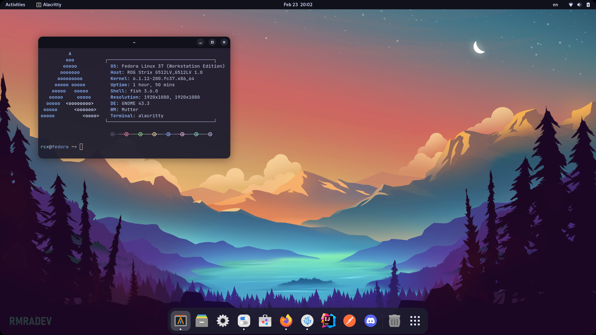
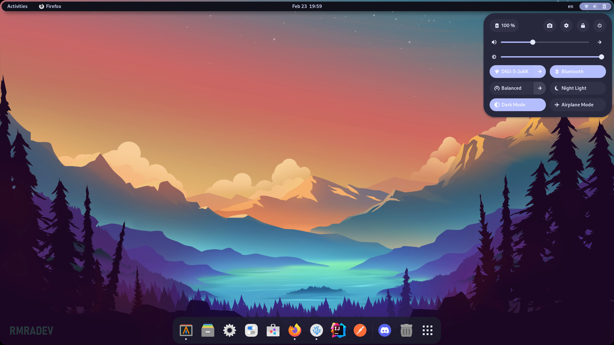
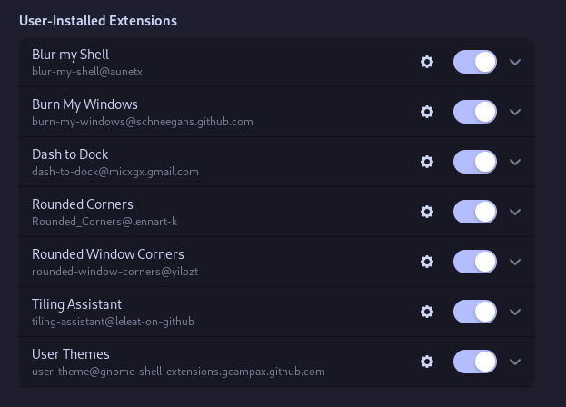

# Catppuccin Shell

This is a custom user theme designed to bring the **Catppuccin** color
schemes to the **GNOME Shell**, while keeping in tone with the default look.

**Note!** I am not affiliated with the **Catppuccin** team, I just like their
color scheme :smile:. You can find more of them
[here](https://github.com/catppuccin/catppuccin).

## Requirements
[GNOME DE]()
(at least 43.x)

[GNOME Tweaks](https://github.com/GNOME/gnome-tweaks)
(to set the user theme)

[GNOME Extensions](https://gitlab.gnome.org/GNOME/gnome-shell-extensions)
(to be able to install the *User Themes* extension if not already there)

[User Themes](https://extensions.gnome.org/extension/19/user-themes/)
(to be able to set the theme in **GNOME Tweaks**)

## Installation
Clone the repo and execute the script:
```
git clone https://github.com/RCX777/catppuccin-shell
chmod +x install.sh
./install.sh
```
Open **GNOME Tweaks**, navigate to *Appearance* and select the *Shell*.

## Variants
- **Mocha** &rarr; Classic Panel

  

- **Mocha** &rarr; Rounded Panel
  
  

## Recommendations

### Extensions:

**Note!** Try playing around with the border radius of the screen and
window corners to match the rounded panel! Also, if you decide to use the
rounded panel, you can set the window gap in the *Tiling Assistant* extension
to avoid having windows awkwardly touch the rounded top bar. 

  

### Applications and other theming:
You can use [Gradience](https://github.com/GradienceTeam/Gradience) to set
the colors of **GTK4** & **libadwaita** apps to the Catppuccin colors, and
by using the [adw-gtk3](https://github.com/lassekongo83/adw-gtk3) theme, you
can also change the look of older apps to match the theme.
